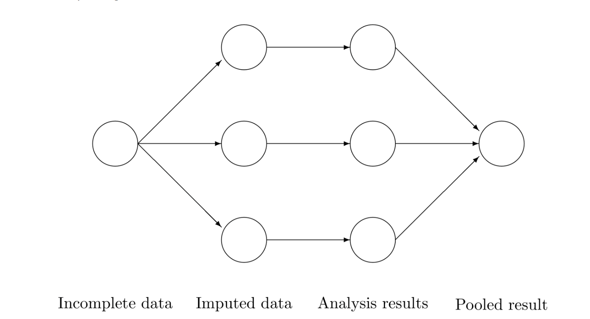

```{r}
#| label: setup
#| echo: FALSE

library(tidyverse)
library(showtext) # 显示pdf中图片的字体
showtext_auto() # 自动显示图片中的文字
library(gt) # 输出表格
library(mice)
library(gtsummary) # 输出表格
library(tidymodels) # 模型
library(pdftools)
tidymodels_prefer()
```

## 多重插补的一般流程

- 数据有缺失值
- 用链式方程式多重插补法填补缺失值，得到多个完整数据集
- 在每个完整数据集上分别进行分析
- 将分析结果汇总


## 常见错误

- 插补结束后只用**其中一个**完整数据集进行分析
- 把多个插补的完整数据集合并成一个**大数据集**直接分析
- 分别分析后直接**平均**所有统计量

## 最简单的代码流程

```{r}
#| label: mice_simple
#| include: TRUE

library(mice)

data("airquality")

imp <- mice(airquality, seed = 1, m = 20, print = FALSE)
fit <- with(imp, lm(Ozone ~ Wind + Temp + Solar.R))
pool <- pool(fit)

tidy(pool, conf.int = TRUE) # 比`summary`更好用
```

## 结合其他包的分析流程

```{r}
#| label: mice_show
#| eval: false
#| code-line-numbers: "1-7|8-14|15-21|22-29|30-36|37-47"

# mids workflow using pipes
library(magrittr)
est2 <- nhanes |>
  mice(seed = 123, print = FALSE) |>
  with(lm(chl ~ age + bmi + hyp)) |>
  pool()

# mild workflow using base::lapply
est3 <- nhanes |>
  mice(seed = 123, print = FALSE) |>
  mice::complete("all") |>
  lapply(lm, formula = chl ~ age + bmi + hyp) |>
  pool()

# mild workflow using pipes and base::Map
est4 <- nhanes |>
  mice(seed = 123, print = FALSE) |>
  mice::complete("all") |>
  Map(f = lm, MoreArgs = list(f = chl ~ age + bmi + hyp)) |>
  pool()

# mild workflow using purrr::map
library(purrr)
est5 <- nhanes |>
  mice(seed = 123, print = FALSE) |>
  mice::complete("all") |>
  map(lm, formula = chl ~ age + bmi + hyp) |>
  pool()

# long workflow using base::by
est6 <- nhanes |>
  mice(seed = 123, print = FALSE) |>
  mice::complete("long")  |>
  by(as.factor(.$.imp), lm, formula = chl ~ age + bmi + hyp) |>
  pool()

# long workflow using a dplyr list-column
library(dplyr)
est7 <- nhanes |>
  mice(seed = 123, print = FALSE) |>
  mice::complete("long") |>
  group_by(.imp) |>
  do(model = lm(formula = chl ~ age + bmi + hyp, data = .)) |>
  as.list() |>
  .[[-1]] |>
  pool()
```

## tidymodels结合mice

```{r}
#| label: tidymodels_mice
#| code-line-numbers: "1-7|8-12|13-35|36-50|51-56|57-60"
#| eval: false

# 宽转长-->nest
data |>
  select(imp, all_of(c(outcome_vars, exposure_vars, covariate_vars))) |>
  pivot_longer(all_of(exposure_vars), names_to = "exposure", values_to = "x_value") |>
  pivot_longer(all_of(outcome_vars), names_to = "outcome", values_to = "y_value") |>
  nest(data = -c(imp, 性别, outcome, exposure)) -> data_nest_1

# 定义模型
linear_reg() |>
  set_engine("lm") |>
  set_mode("regression") -> lm_model

# 定义预处理方法和拟合方法
form_none <- as.formula(y_value ~ x_value)

lm_fit_function_cov <- \(data) {
  form_none |>
    update(~ . + 年龄 + 母亲教育水平 + 产次 + 分娩孕周 + 批次 + 断乳月龄 + 出生体重 + 高强度运动) -> form_cov
  
  recipe(form_cov, data = data) |>
    step_log(x_value) |>
    step_scale(y_value) -> lm_recipe_cov
  
  workflow() |>
    add_recipe(lm_recipe_cov) |>
    add_model(lm_model) |>
    fit(data = data) -> lm_fit
  
  lm_fit |>
    tidy(conf.int = TRUE) |>
    mutate(df.residual = lm_fit |>
             glance() |>
             pluck("df.residual", 1))
}

# 定义汇总插补结果的方法
pool_fun <- \(data, var) {
  data |>
    select(imp, 性别, exposure, outcome, all_of(var)) |>
    unnest(all_of(var)) |>
    nest(data = -c(性别, outcome, exposure)) |>
    mutate(tidy = map(data, \(x) {
      x |>
        select(term, estimate, std.error, df.residual) |>
        pool.table(conf.int = TRUE)
    })) |>
    select(-data) |>
    unnest(tidy)
}

# 批量拟合
data_nest_1 |>
  mutate(tidy_none = map(data, lm_fit_function_none),
         tidy_cov = map(data, lm_fit_function_cov)) |>
  select(-data) -> result_1

# 得到结果
result_1 |>
  pool_fun("tidy_none") |>
  filter(term == "x_value") -> result
```

## 复合暴露的多重插补

- **qgcomp**
  - the weights should ***not*** be pooled because they mean different things depending on their direction

- **wqs**
  - 需要用到`miwqs`包，有自己的函数`estimate.wqs`和`est.wqs`

```{r}
#| label: wqs
#| eval: false

# 定义wqs函数
est.wqs <- function(data, b1_pos = TRUE) {
  estimate.wqs(
    y = data$value,
    X = data |>
      select(all_of(exposure_vars)),
    Z = data |>
      select(年龄, 母亲教育水平, 产次, 断乳月龄, 出生体重, 批次, 高强度运动),
    n.quantiles = 10,
    B = 120,
    b1.pos = b1_pos
  ) -> wqs

  rbind(wqs$processed.weights, summary(wqs$fit)$coefficients[c(1, nrow(summary(wqs$fit)$coefficients)), 1:2]) |>
    as.array() -> result
}

# 分别计算正向和负向的wqs
data_nest_1 |>
  mutate(wqs_pos = map(data, ~ est.wqs(., TRUE)),
         wqs_neg = map(data, ~ est.wqs(., FALSE))) -> result_wqs
```

## 复合暴露R包的多重插补理念

- 认为暴露混合物有缺失值，如未检出的值
- 认为协变量无缺失值
- 需要重新整理代码，不能拿官方的workflow直接用

## 中介分析

- **mediation**
- 有自己的函数`mediations`和`amelidiate`

```{r}
#| label: mediation
#| eval: false

mediators <- c("m_value")
outcome <- c("y_value")
treatment <- paste0("x_", 1:20, "_value")
covariates <- c("年龄", "母亲教育水平", "产次", "分娩孕周", "批次", "出生体重", "断乳月龄", "高强度运动")

data_nest |>
mutate(mediation = map(list, \(x) {
    mediators <- c("m_value")
    outcome <- c("y_value")
    treatment <- paste0("x_", 1:20, "_value")
    covariates <- c("年龄", "母亲教育水平", "产次", "分娩孕周", "批次", "出生体重", "断乳月龄", "高强度运动")
    mediations(x, treatment, mediators, outcome, covariates, interaction = FALSE, conf.level = 0.90, sims = 200)})) |>
  mutate(mediation = map(mediation, ~ amelidiate(.x))) -> result_pool
```

## 新的补充

- `mice`包的开发版本有一个新的函数`pool.table`，可以直接对`tidy`的结果进行汇总
- 需要4个变量，`term`, `estimate`, `std.error`, `df.residual`，前三个可以用`tidy()`提取，自由度可以用`glance()`提取

```{r}
#| label: pool.table

# devtools::install_github(repo = "amices/mice")

library(mice)

imp <- mice(nhanes2, m = 2, maxit = 2, seed = 1, print = FALSE)
fit <- with(imp, lm(chl ~ age + bmi + hyp))

# tbl <- tidy(fit) |>
#   mutate(df.residual = glance(fit) |>
#            pluck("df.residual", 1))

tbl <- summary(fit)[, c("term", "estimate", "std.error", "df.residual")]
tbl

pool <- pool.table(tbl, conf.int = TRUE)
pool
```

